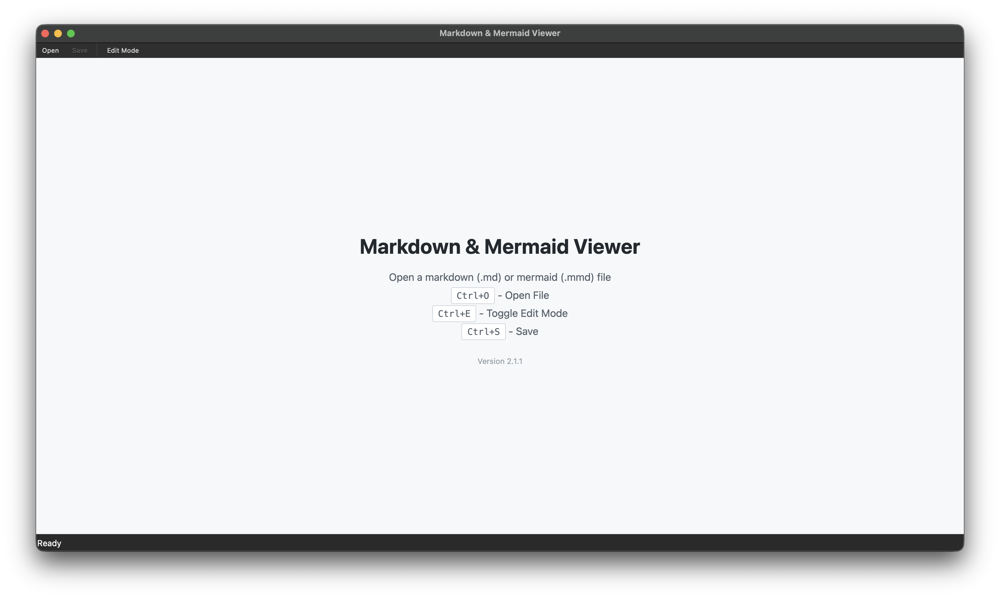
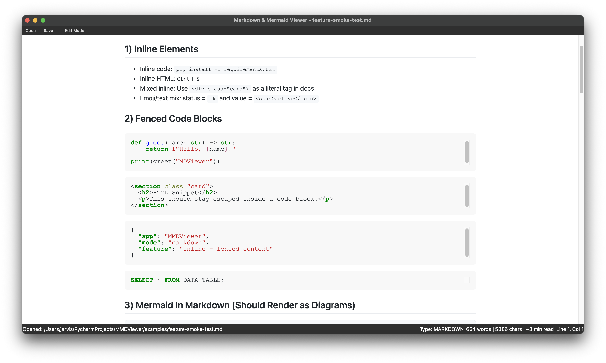
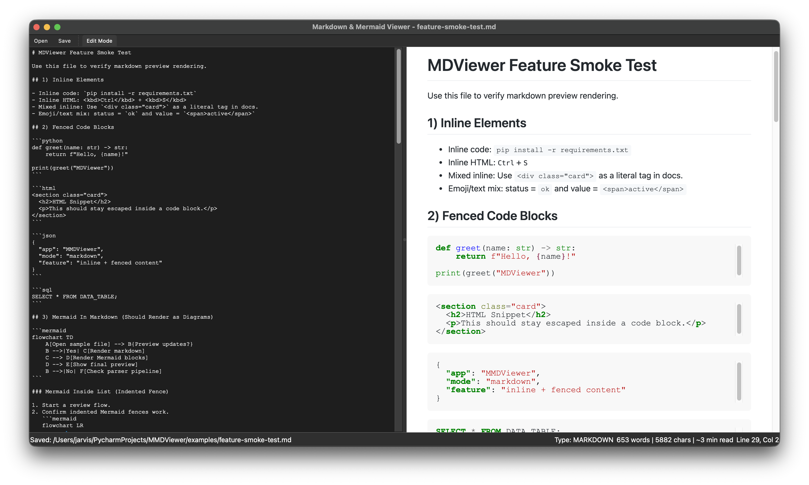
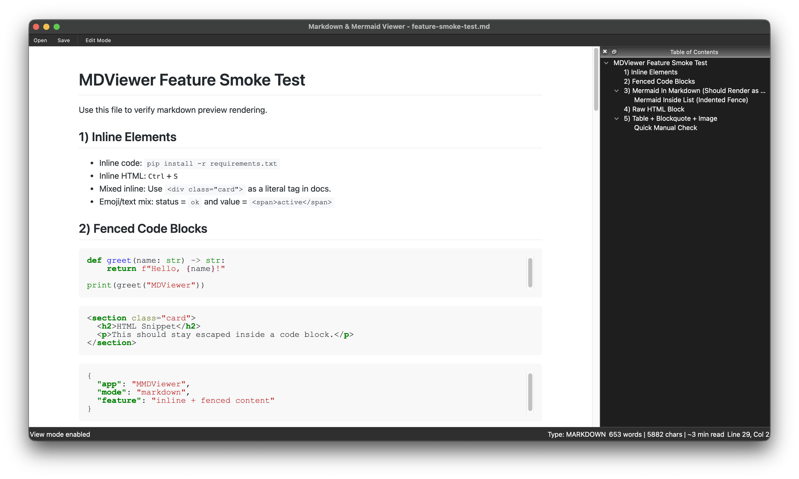
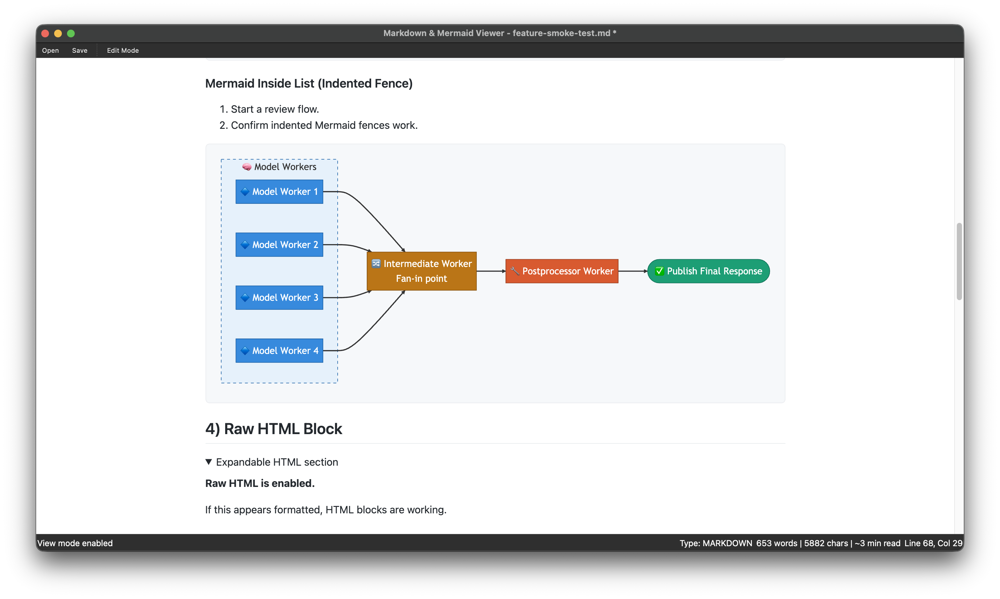
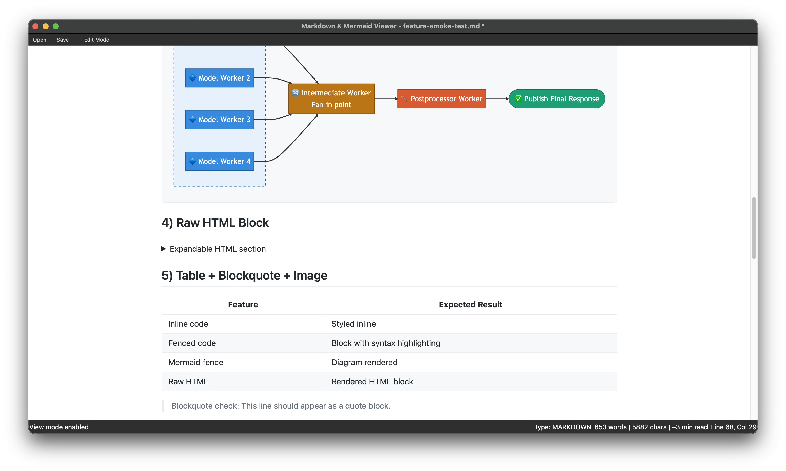
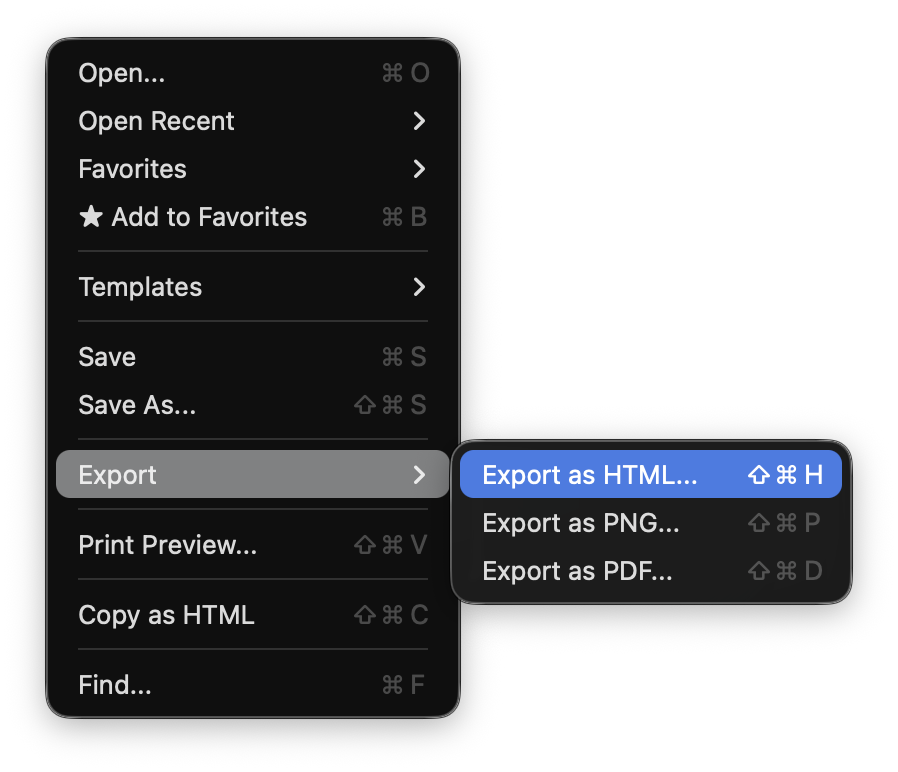
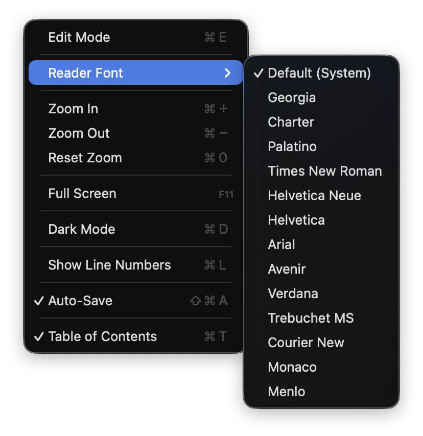

# Markdown & Mermaid Viewer

A powerful desktop application for viewing and editing Markdown documents and Mermaid diagrams with extensive customization options.


## Screenshots

### Main UI








### Menus and Actions

<p>
  
  
</p>

## Features

### 📝 Dual Format Support
- **Markdown** (.md, .markdown, .mdown, .mkd) - GitHub-flavored with code highlighting, tables, TOC
- **Mermaid** (.mmd, .mermaid) - Flowcharts, sequence diagrams, Gantt charts, class & ER diagrams

### ✨ Powerful Editing
- Split-pane editor with real-time preview (300ms debounce)
- Line numbers with gutter display
- Find & replace with case-sensitive and whole word options
- Auto-save with draft recovery
- Image paste from clipboard

### 🎨 Customization
- **19 reading fonts** - Serif, sans-serif, and monospace options
- **Dark mode** - Easy on the eyes for night work
- **Zoom controls** - 10% to 300% zoom range
- **Full-screen mode** - Distraction-free viewing

### 📤 Export & Share
- Export to HTML (standalone with embedded CSS)
- Export to PNG (high-quality images for diagrams)
- Export to PDF (print-ready documents)
- Print preview with page layout options
- Copy as HTML to clipboard

### 🚀 Productivity Features
- **Table of Contents** - Navigate long documents with sidebar outline
- **Favorites/Bookmarks** - Quick access to frequently used files
- **Markdown Templates** - 6 pre-built templates (README, Blog, Meeting Notes, etc.)
- **Word count & reading time** - Track document statistics
- **Recent files** - Quick access to last 10 opened files

## Installation

### Quick Start

```bash
# Clone the repository
git clone <repository-url>
cd MDViewer

# Install dependencies
pip install -r requirements.txt

# Run the application
python main.py
```

### Open a File

```bash
# Open specific file
python main.py path/to/document.md

# Or just launch and use File → Open
python main.py
```

## Web Core (New)

A new web core project is available in [`web/`](web/README.md) with:
- Vite + TypeScript
- CodeMirror 6 editor
- Mermaid 11 renderer
- Local-first drafts (IndexedDB with OPFS mirroring when supported)

Quick start:

```bash
cd web
npm install
npm run dev
```

## Usage

### Keyboard Shortcuts

| Action | Shortcut |
|--------|----------|
| Open File | `Ctrl+O` |
| Save | `Ctrl+S` |
| Toggle Edit Mode | `Ctrl+E` |
| Find | `Ctrl+F` |
| Toggle Favorites | `Ctrl+B` |
| Toggle TOC | `Ctrl+T` |
| Zoom In/Out/Reset | `Ctrl++` / `Ctrl+-` / `Ctrl+0` |
| Full Screen | `F11` |
| Dark Mode | `Ctrl+D` |
| Auto-Save | `Ctrl+Shift+A` |
| Cheat Sheet | `Ctrl+?` |

See [docs/QUICKSTART.md](docs/QUICKSTART.md) for detailed usage guide.

## Documentation

- **[QUICKSTART.md](docs/QUICKSTART.md)** - Getting started guide
- **[FEATURES.md](docs/FEATURES_COMPLETE.md)** - Complete feature list
- **[FONT_SELECTION.md](docs/FONT_SELECTION.md)** - Font customization guide
- **[MERMAID_GUIDE.md](docs/MERMAID_GUIDE.md)** - Mermaid diagram guide
- **[GANTT_GUIDE.md](docs/GANTT_GUIDE.md)** - Gantt chart best practices

## Project Structure

```
MDViewer/
├── mdviewer/              # Main application package
│   ├── viewer.py          # Core viewer logic
│   ├── widgets/           # Custom widgets (line numbers, etc.)
│   └── resources/         # Templates and resources
├── assets/                # Icons and images
│   └── icons/             # Application icons
├── docs/                  # Documentation
├── examples/              # Example markdown and mermaid files
├── main.py                # Application entry point
├── requirements.txt       # Python dependencies
├── LICENSE                # MIT License
└── README.md              # This file
```

## Requirements

- Python 3.8+
- PyQt5 >= 5.15.0
- PyQtWebEngine >= 5.15.0
- markdown >= 3.5.0
- Pygments >= 2.17.0

## License

MIT License - See [LICENSE](LICENSE) file for details.

## Author

Developed by **Jilani Shaik**

---

**Markdown & Mermaid Viewer** - Your professional markdown editor
