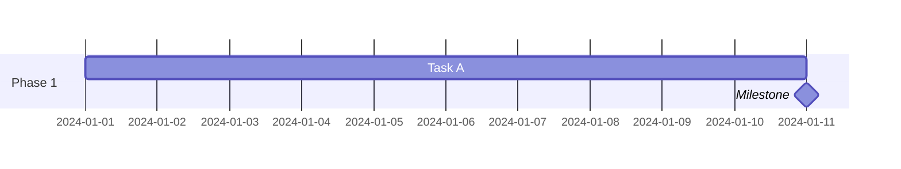
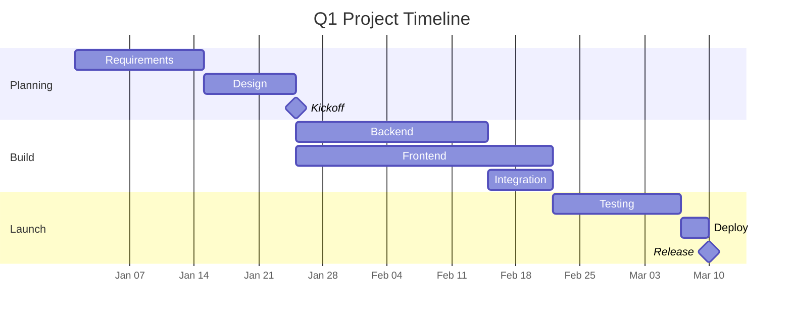

# Gantt Chart Rendering Guide

## Fixed Issues

The viewer now properly renders Gantt charts with:

✅ **Adequate left padding** (200px) for task names
✅ **Reduced tick density** (1 week intervals)
✅ **Full-width container** with horizontal scrolling
✅ **Rotated axis labels** to prevent overlap
✅ **Proper spacing** between bars and sections

## Configuration Applied

```javascript
gantt: {
    titleTopMargin: 25,
    barHeight: 30,           // Height of each task bar
    barGap: 8,               // Space between bars
    topPadding: 50,          // Space above chart
    leftPadding: 200,        // Space for task labels ✨
    gridLineStartPadding: 100,
    fontSize: 12,
    axisFormat: '%m/%d',     // Date format: 01/15
    tickInterval: '1week',   // One tick per week ✨
    weekday: 'monday'
}
```

## Writing Better Gantt Charts

### 1. Keep Task Names Short

❌ **Bad:**
```mermaid
Requirements Gathering and Analysis
```

✅ **Good:**
```mermaid
Requirements
```

### 2. Use Descriptive Section Names

```mermaid
gantt
    section Planning Phase
    section Development
    section Testing
```

### 3. Choose Appropriate Date Format

```mermaid
gantt
    dateFormat YYYY-MM-DD
    axisFormat %m/%d        # 01/15
    # or
    axisFormat %b %d        # Jan 15
```

### 4. Set Reasonable Tick Intervals

For long projects (3+ months):
```mermaid
%%{init: { 'gantt': {'tickInterval': '1week'} }}%%
```

For short projects (< 1 month):
```mermaid
%%{init: { 'gantt': {'tickInterval': '1day'} }}%%
```

### 5. Add Milestones



## Example: Well-Formatted Gantt



## Viewing in the App

1. Open your `.mmd` file
2. The chart automatically uses optimized settings
3. Horizontal scrollbar appears if needed
4. X-axis labels are rotated -45° for readability
5. Export works correctly (HTML/PNG/PDF)

## Troubleshooting

### Labels Still Overlap?

Shorten your task names or increase tick interval:
```mermaid
%%{init: { 'gantt': {'tickInterval': '2week'} }}%%
```

### Chart Too Wide?

This is normal for Gantt charts! Use horizontal scroll or:
- Reduce project duration
- Use longer tick intervals
- Reduce number of tasks

### Export PNG Cuts Off?

The PNG export now captures the full SVG width automatically.

## Examples

Check these files:
- `examples/gantt.mmd` - Full project example
- `examples/gantt_simple.mmd` - Minimal example
- `test_gantt.mmd` - Complex multi-phase project
