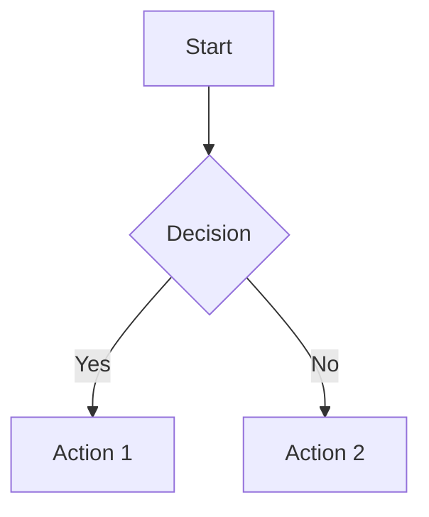
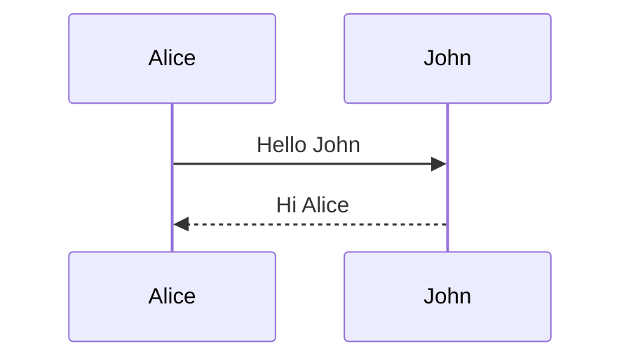
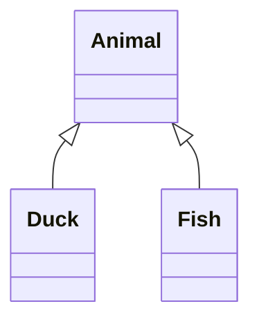
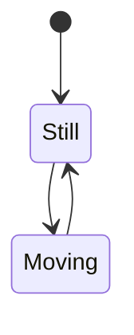
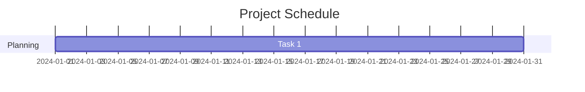
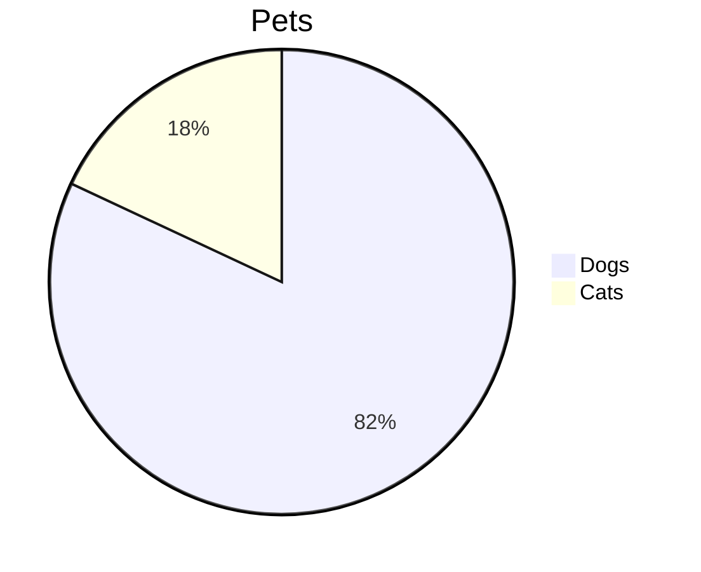
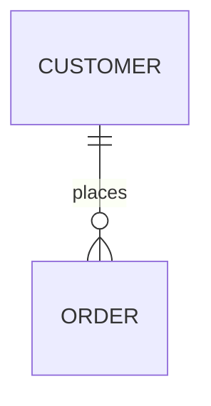

# Mermaid Diagram Guide

## What is Mermaid?

Mermaid is a JavaScript-based diagramming tool that renders text-based diagrams into visual charts. Perfect for documentation, flowcharts, and diagrams.

## Supported Diagram Types

### 1. Flowchart

### 2. Sequence Diagram

### 3. Class Diagram

### 4. State Diagram

### 5. Gantt Chart

### 6. Pie Chart

### 7. ER Diagram

## Using in the Application

1. **Create** a new file with `.mmd` or `.mermaid` extension
2. **Write** your mermaid diagram code
3. **View** real-time rendering
4. **Export** as:
   - HTML (standalone file)
   - PNG (image)
   - PDF (document)

## Tips

- Use `Ctrl+E` to toggle edit mode
- Changes render automatically after 300ms
- Syntax errors show in the viewer
- Style nodes with CSS-like syntax

## Examples in sample.mmd

Check `sample.mmd` for a working example!
